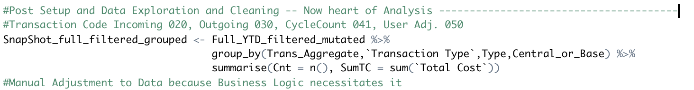

# Logistics/Warehouse

***Inventory Transaction Analysis***

**Logic and Methodology High-Level Discussion:**

- *GroupBy Transaction Types then Count and SUM the “Total Cost” field*

    If we want to Isolate CS004, we can EXCLUDE all Business UNIT later

**Location of Data Bundle:** 

PATH to full bundle which contains (DATA, R-Code, and Output Viz)

**O:///S_Taing/Logistics-Warehouse** also code and markdown on GitHUB soon

R-Code latest version is: **InOUT_Tidyverse_v8.R**

**Current Findings/Presentation:** 

*Holding off hunting the ~522K but suspect it movement of Avg_mat_cost price change over time

*See Appendix for OCT18, OCT19 Numbers Calculation

**Overall Analysis Goal:** 

Account for (~1.9M) On-Hand Inventory Difference

SubGoal: System-Wide Incoming/Outgoing Total Dollar (Book) Value 

1. Total Cost is QTY on Hand X Avg. Matl Cost (See Sample Output Below)

We can isolate by CS004 ONLY later on if needed (particularly remove CS001, CS002, ~~CS003~~) 

 revision: CS003 filtered b/c Capt'l Spares codification (Capt'l Spare prior price $1 so garbage output)

**FMIS Query Details:**

Original Stock Query: SCRD_3031_CHARGES modified

Used: **SLT_SCRD_INOUT_CHARGES_V3** with Expanded Modification of Transaction Group List (from 030, 031) to all in Definition Table

v3 revision: Adj_Type is **added b/c 050 "Decrease" is not handle properly** —consistent with others—namely not made to be a negative Total Price (Special handle in R-code)

Location and Ship_CUst_Name1 is added to splice CS to E&M or Everett (See Appendix)

Sample Query Output Below— "Type" is Adjustment Type (D)ecrease or (I)ncrease

**Overall Logic:** 

By FMIS Inventory Transaction Group Codes we will be able to differentiate Incoming, Outgoing, Misc. Transactions

(See Definition Table for Details).

**DISCUSSION/UPDATES:**

Per Kate’s Response:

~~Also, I see in your methodology that you will exclude interunit transfers; but I don’t see that in the Overall Logic. Am I reading this wrong? We would no longer be counting 031, since that would duplicate any usages (for example, if we 031 transfer a part to a base and then the base 030 uses it, it will count twice?)~~

Update: We will simple purge IBU- 031 from the analyst, avoiding double counting issues.

**APPENDIX**

BY Transaction Summarized

[Lead Time And Shelf Age](https://www.notion.so/Lead-Time-And-Shelf-Age-6ced81bdbd2b45baa971a19981fde057)

[Turns Documentation](https://www.notion.so/Turns-Documentation-ba0c938fce9f48d8b55925ef6778f59b)

[ABC Analysis in Inventory Management (proxy to full Demand)](https://www.notion.so/ABC-Analysis-in-Inventory-Management-proxy-to-full-Demand-3777f1186c204117b36cb7f4ca3200f1)

[Isolating Avg. Cost Price Movement](https://www.notion.so/Isolating-Avg-Cost-Price-Movement-9cbda1164b88451eb4da120423fee528)
